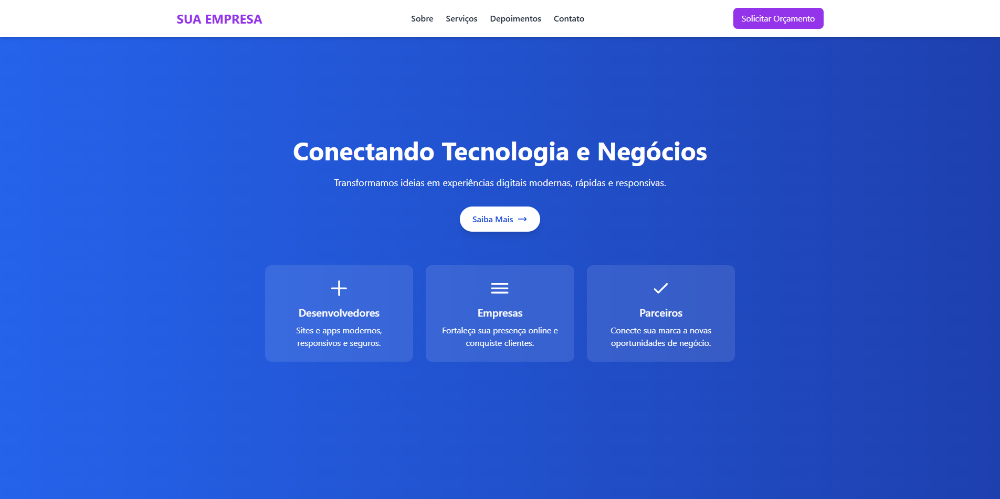

# Landing Page Corporativa em React

Este é um projeto simples e funcional de **landing page corporativa**, desenvolvido em **React** com **Tailwind CSS** e **Framer Motion**. Ele permite que empresas apresentem seus serviços, parceiros, depoimentos e formulário de contato em uma interface moderna e responsiva.


## Funcionalidades

- **Seção Hero Animada**: Apresenta título, subtítulo, botão de ação e ícones ilustrativos.  
- **Sobre**: Breve descrição da empresa ou do projeto.  
- **Serviços / Funcionalidades**: Destaca os principais serviços oferecidos.  
- **Parceiros**: Carrossel de logos de empresas ou parceiros.  
- **Depoimentos**: Feedback de clientes ou usuários.  
- **Contato**: Formulário funcional para envio de mensagens.  
- **Footer**: Informações de direitos autorais.  
- **Animações**: Todas as seções possuem animações suaves com **Framer Motion**.

## Estrutura do Projeto

- `App.jsx`: Arquivo principal que organiza todas as seções da página.  
- `index.js`: Ponto de entrada da aplicação React.  
- `index.css`: Folha de estilo principal com Tailwind CSS.  
- `/components`: Pasta com todos os componentes da landing page:
  - `Hero.jsx`
  - `Navbar.jsx`
  - `Sobre.jsx`
  - `Servicos.jsx`
  - `Features.jsx`
  - `Depoimentos.jsx`
  - `Parceiros.jsx`
  - `Contato.jsx`
  - `Footer.jsx`

## Como Executar o Projeto

1. **Clonar o repositório**:

```bash
git clone https://github.com/Lucaszki/landing-page-corporativa.git
